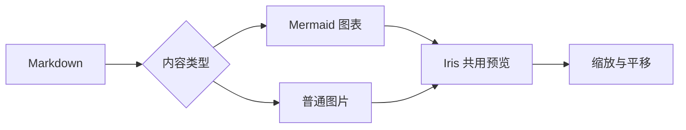
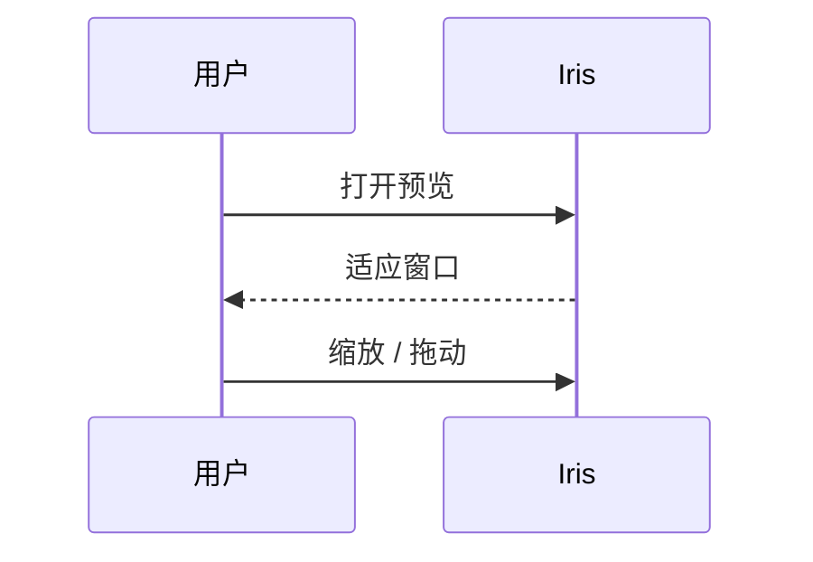

# Iris：Mermaid 与图片预览

点击图表或图片，使用滚轮/按钮缩放、拖动/方向键平移、双指缩放、0 复位、Esc 关闭。

## Mermaid

```mermaid
flowchart LR
  A[Markdown] --> B{内容类型}
  B --> C[Mermaid 图表]
  B --> D[普通图片]
  C --> E[Iris 共用预览]
  D --> E
  E --> F[缩放与平移]
```

```mermaid
sequenceDiagram
  participant U as 用户
  participant I as Iris
  U->>I: 打开预览
  I-->>U: 适应窗口
  U->>I: 缩放 / 拖动
```

## 普通 SVG 图片

## 带链接的图片

普通点击预览，Ctrl/Cmd 点击保留链接打开行为。

## 排除图片

[前往下一页验证路由切换](./second.md)
